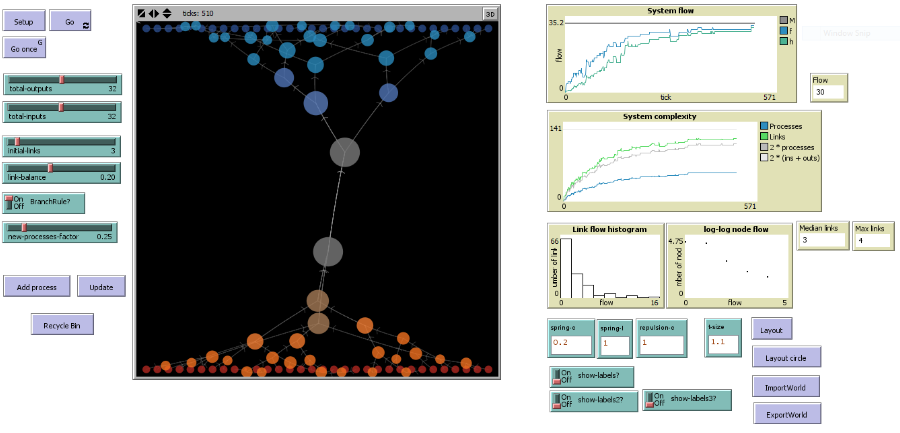
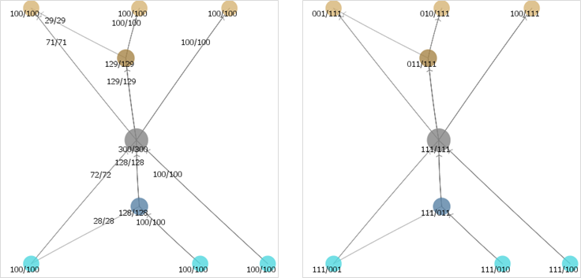
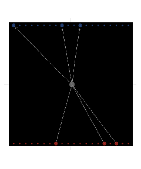
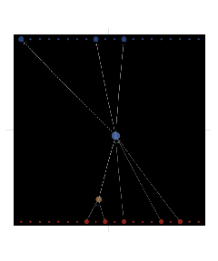
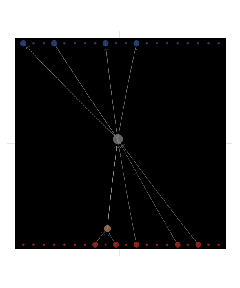
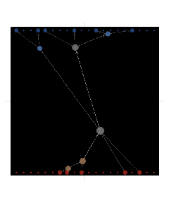
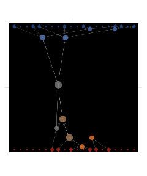
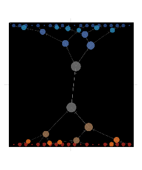
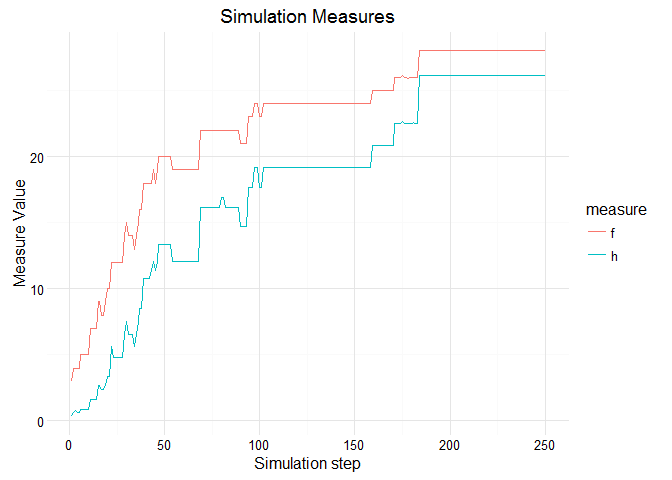

# Network Flow Model
Darko Bergant  
2016-03-27  

## PURPOSE

The model demonstrates self-organisation of network structure, optimising flow from fixed diverse inputs to fixed diverse outputs.

## HOW IT WORKS

**Open System**

Model simulates a distribution of demand and supply to intermediate network nodes based on system inputs and outputs. Inputs represent fixed diverse supply and outputs represent fixed diverse demand.

**Network Structure**

Intermediate nodes are connected to each other as inputs and outputs. Each node represents a demand to his input nodes and supply to his output nodes. Each node is also an information source to other nodes – current demand level is sensed from output nodes and supply level is sensed from input nodes.

**Dynamic System**

The network structure is self-designed and based on the decisions of individual vertices. The connection between two vertices is kept only if there is enough flow between the vertices which share the connection. New vertices are born periodically and they survive only if they carry enough flow. Flow is defined as the least of supply and demand.	

**Bounded Information**

Each vertex can only use the information available at neighbour vertices. 	Also there is a maximum number of connections each vertex can handle. But there is no quantitative restrictions on flow for nodes nor connections.	

**Diversity**

Each input node represent unique supply (good or service) and each output node represent special demand. The model defines each system input as a unit vector in N-dimensional space (if there are N inputs). In English: in case of 4 input nodes they would be defined as 1000, 0100, 0010 and 0001. Same with outputs. Merging two different inputs in some intermediate node would result in a combination of different types of flows (e.g. 1100 or 1010). 	

## HOW TO USE IT

Parameters:

- Set the number of inputs and outputs (from 20 to 60 should be OK)

- Set the number of initial links (3 is enough to start with)

- Link balance is the threshold for killing links with less flow then a percentage of node flow. With 0.2 you can expect around 2 or 3 links per node.

- new-processes-factor defines how many new nodes will model try to add at each iteration (number of nodes * factor)

Use **Setup** to apply your parameters and start with **Go**.

## THINGS TO NOTICE

Usually the system nodes get organised in a double-tree hierarchical structure.

Step 0, 1 and 2:

Simulation at 5, 10 and 15:

Simulation at 100:

## MEASURES

Overall system flow can be measured as a sum of flows at the outputs (f).

More interesting measure is corrected flow based on expected diversity (h).
It is calculated by dividing the flow on every output by number
of expected inputs (= number of system inputs) and multiplied by
the number of realised inputs.

If every input is represented in every output, the corrected flow is
same as overall system flow.

## THINGS TO TRY

Try to change link-balance parameter and observe the speed of convergence and structure shape.

If you switch off the branch rule, the system can't find the path to organized structure. Branch rule prohibits cycles in the structure for new nodes and connections.

## CREDITS AND REFERENCES

Darko Bergant, Network Flow, (2015), GitHub repository, https://github.com/bergant/NetworkFlow

This work is licensed under a [Creative Commons Attribution-NonCommercial-ShareAlike 3.0 Unported License](http://creativecommons.org/licenses/by-nc-sa/3.0/)

